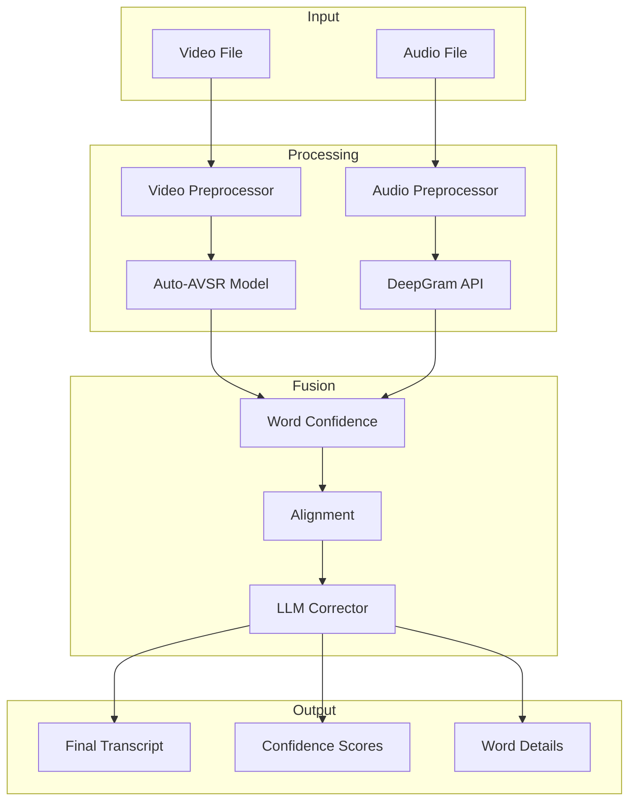
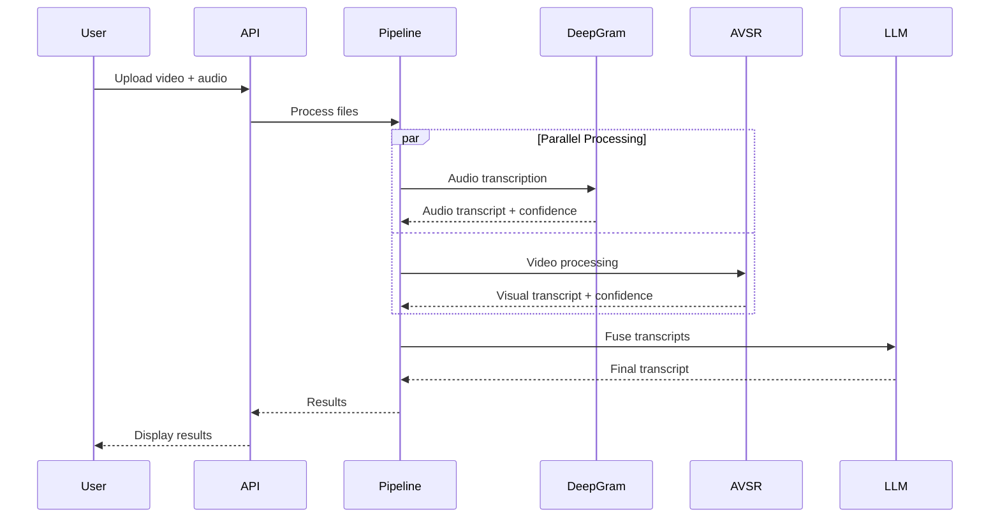

# System Architecture

Technical architecture and design documentation for the LAALM multi-modal transcription system.

## Table of Contents

- [Overview](#overview)
- [System Design](#system-design)
- [Components](#components)
- [Data Flow](#data-flow)
- [Model Architecture](#model-architecture)
- [Integration Points](#integration-points)
- [Performance Considerations](#performance-considerations)

## Overview

LAALM is a multi-modal speech transcription system that combines three complementary approaches:

1. **Audio Transcription** (DeepGram API)
2. **Visual Lip-reading** (Auto-AVSR)
3. **LLM-based Fusion** (Groq/OpenAI)

This architecture provides robustness against noisy audio, accented speech, and challenging environmental conditions.

## System Design

### High-Level Architecture



### Component Layers

```
┌─────────────────────────────────────────────────┐
│           Presentation Layer                     │
│  ┌──────────────┐        ┌──────────────┐       │
│  │ Web Interface│        │  CLI         │       │
│  └──────────────┘        └──────────────┘       │
└─────────────────────────────────────────────────┘
                      │
┌─────────────────────────────────────────────────┐
│           API Layer                              │
│  ┌──────────────────────────────────────┐       │
│  │  FastAPI REST Endpoints              │       │
│  └──────────────────────────────────────┘       │
└─────────────────────────────────────────────────┘
                      │
┌─────────────────────────────────────────────────┐
│           Business Logic Layer                   │
│  ┌──────────────┐  ┌──────────────┐            │
│  │  Pipeline    │  │  Fusion      │            │
│  │  Orchestrator│  │  Engine      │            │
│  └──────────────┘  └──────────────┘            │
└─────────────────────────────────────────────────┘
                      │
┌─────────────────────────────────────────────────┐
│           Model Layer                            │
│  ┌─────────┐  ┌─────────┐  ┌─────────┐         │
│  │DeepGram │  │Auto-AVSR│  │  LLM    │         │
│  └─────────┘  └─────────┘  └─────────┘         │
└─────────────────────────────────────────────────┘
```

## Components

### 1. Video Processing Pipeline

**Location:** `auto_avsr/`

**Responsibilities:**
- Face detection (RetinaFace or MediaPipe)
- Mouth region extraction
- Frame preprocessing
- Visual feature extraction
- Lip-reading inference

**Key Files:**
- `inference_wrapper.py` - Main inference interface
- `preprocessor.py` - Video preprocessing
- `preparation/detectors/` - Face detection modules

**Flow:**
```
Video Input → Face Detection → Mouth Cropping → 
Frame Normalization → Feature Extraction → 
AVSR Model → Visual Transcript
```

### 2. Audio Processing Pipeline

**Location:** `DeepGram/`

**Responsibilities:**
- Audio preprocessing
- DeepGram API integration
- Word-level confidence extraction
- Timestamp alignment

**Key Files:**
- `transcriber.py` - DeepGram API client
- `word_confidence.py` - Confidence calculation
- `preprocessor.py` - Audio preprocessing

**Flow:**
```
Audio Input → Preprocessing → DeepGram API → 
Audio Transcript + Confidence + Timestamps
```

### 3. LLM Fusion Engine

**Location:** `Transformer/`

**Responsibilities:**
- Multi-modal alignment
- Confidence-based fusion
- Context-aware correction
- Final transcript generation

**Key Files:**
- `llm_corrector.py` - LLM integration
- `fusion.py` - Fusion logic
- `alignment.py` - Word alignment
- `reliability.py` - Confidence scoring

**Flow:**
```
Audio Transcript + Video Transcript → 
Word Alignment → Confidence Weighting → 
LLM Correction → Final Transcript
```

### 4. Web Interface

**Location:** `frontend/`, `api.py`

**Responsibilities:**
- User interface
- File upload handling
- Real-time progress updates
- Results visualization

**Technology Stack:**
- **Frontend:** React + Vite + TailwindCSS
- **Backend:** FastAPI + Uvicorn
- **Communication:** REST API

## Data Flow

### Complete Processing Pipeline



### Data Structures

**Input:**
```python
{
    "video_file": Path,
    "audio_file": Optional[Path],
    "config": {
        "detector": "retinaface",
        "llm_model": "llama-3.3-70b-versatile"
    }
}
```

**Intermediate (Audio):**
```python
{
    "transcript": str,
    "confidence": float,
    "words": [
        {
            "word": str,
            "confidence": float,
            "start": float,
            "end": float
        }
    ]
}
```

**Intermediate (Video):**
```python
{
    "transcript": str,
    "confidence": float,
    "frames_processed": int
}
```

**Output:**
```python
{
    "final_transcript": str,
    "final_confidence": float,
    "audio_transcript": str,
    "audio_confidence": float,
    "video_transcript": str,
    "video_confidence": float,
    "word_details": [
        {
            "word": str,
            "audio_conf": float,
            "video_conf": float,
            "source": str,
            "start_time": float,
            "end_time": float
        }
    ],
    "corrections_applied": int,
    "processing_time": float
}
```

## Model Architecture

### Auto-AVSR Model

**Architecture:** Transformer-based encoder-decoder

**Components:**
1. **Visual Frontend:**
   - 3D CNN for spatiotemporal features
   - ResNet-18 backbone
   - Output: 512-dim features per frame

2. **Encoder:**
   - Conformer blocks (Transformer + Convolution)
   - Multi-head self-attention
   - Positional encoding

3. **Decoder:**
   - Transformer decoder
   - Cross-attention with encoder
   - CTC loss for training

**Input:** 
- Video: 25 fps, mouth-cropped frames (88x88 pixels)
- Grayscale or RGB

**Output:**
- Character-level predictions
- Decoded to words using beam search

### DeepGram Model

**Type:** Proprietary end-to-end speech recognition

**Features:**
- Multi-language support
- Speaker diarization
- Punctuation and formatting
- Word-level timestamps
- Confidence scores

### LLM Corrector

**Models Supported:**
- **Groq:** llama-3.3-70b-versatile (default)
- **OpenAI:** gpt-4, gpt-3.5-turbo

**Approach:**
- Prompt engineering with context
- Confidence-weighted fusion
- Grammar and context correction
- Maintains original meaning

**Prompt Structure:**
```
You are correcting a transcript from audio and visual sources.

Audio transcript (confidence: 0.98): "lay white with zero again"
Video transcript (confidence: 0.51): "lay white at zero again"

Provide the most accurate transcript considering both sources.
Prefer higher confidence sources but use context to resolve conflicts.
```

## Integration Points

### External APIs

**DeepGram API:**
- Endpoint: `https://api.deepgram.com/v1/listen`
- Authentication: API key in header
- Rate limits: Based on plan
- Fallback: Mock transcription

**Groq API:**
- Endpoint: `https://api.groq.com/openai/v1/chat/completions`
- Authentication: API key in header
- Rate limits: Based on plan
- Fallback: OpenAI API

**OpenAI API (Optional):**
- Endpoint: `https://api.openai.com/v1/chat/completions`
- Authentication: API key in header
- Rate limits: Based on plan

### Internal Interfaces

**Pipeline Interface:**
```python
def run_mvp(
    video_file: str,
    audio_file: Optional[str] = None,
    lipnet_weights: Optional[str] = None,
    detector: str = "retinaface"
) -> Dict[str, Any]:
    """Main pipeline entry point."""
    pass
```

**AVSR Interface:**
```python
def get_avsr_confidence(
    video_path: str,
    detector: str = "retinaface"
) -> Dict[str, Any]:
    """Get visual transcript with confidence."""
    pass
```

**DeepGram Interface:**
```python
def get_deepgram_confidence(
    audio_path: str
) -> Dict[str, Any]:
    """Get audio transcript with confidence."""
    pass
```

## Performance Considerations

### Bottlenecks

1. **Video Processing:** Most time-consuming
   - Face detection: ~0.5s per frame
   - AVSR inference: ~5-10s per video
   - **Optimization:** Use GPU, batch processing

2. **API Calls:** Network latency
   - DeepGram: ~1-3s
   - Groq/OpenAI: ~1-2s
   - **Optimization:** Parallel processing, caching

3. **File I/O:** Disk operations
   - Video reading: ~1-2s
   - **Optimization:** SSD storage, streaming

### Optimization Strategies

**Parallel Processing:**
```python
# Audio and video processed in parallel
with concurrent.futures.ThreadPoolExecutor() as executor:
    audio_future = executor.submit(process_audio, audio_file)
    video_future = executor.submit(process_video, video_file)
    
    audio_result = audio_future.result()
    video_result = video_future.result()
```

**GPU Acceleration:**
- Auto-AVSR uses PyTorch with CUDA
- Face detection can use GPU
- ~3-5x speedup with GPU

**Caching:**
- Cache face detection results
- Cache AVSR features for repeated videos
- Cache LLM responses for identical inputs

### Scalability

**Horizontal Scaling:**
- Stateless API design
- Load balancer for multiple API instances
- Shared file storage (NFS, S3)

**Vertical Scaling:**
- GPU instances for faster processing
- More RAM for larger batch sizes
- SSD for faster I/O

**Recommended Production Setup:**
```
┌──────────────┐
│ Load Balancer│
└──────┬───────┘
       │
   ┌───┴────┬────────┬────────┐
   │        │        │        │
┌──▼──┐  ┌──▼──┐  ┌──▼──┐  ┌──▼──┐
│API 1│  │API 2│  │API 3│  │API 4│
└──┬──┘  └──┬──┘  └──┬──┘  └──┬──┘
   │        │        │        │
   └────────┴────────┴────────┘
            │
    ┌───────▼────────┐
    │ Shared Storage │
    └────────────────┘
```

## Security Considerations

1. **API Keys:** Store in environment variables, never commit
2. **File Upload:** Validate file types, size limits
3. **Temporary Files:** Clean up after processing
4. **Rate Limiting:** Prevent abuse
5. **Input Validation:** Sanitize all inputs
6. **HTTPS:** Use TLS in production
7. **Authentication:** Implement for production

---

**For more information, see:**
- [API Documentation](API.md)
- [Development Guide](DEVELOPMENT.md)
- [Main README](../README.md)
